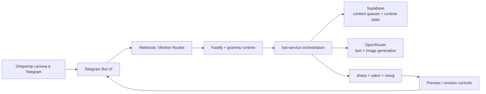

# SMM Automation Bot

Я сделал этот проект как Telegram-first инструмент для небольшого салона красоты, где контент нужно выпускать быстро, без отдельной админки и без ручной сборки каждого поста в нескольких сервисах.

Бот забирает рабочие фото и контентные темы из Supabase, собирает сценарий публикации, генерирует текст и визуалы через OpenRouter и возвращает оператору готовый preview прямо в Telegram. Весь рабочий цикл проходит в одном интерфейсе: от выбора режима до ревизий и финального результата.

## Что умеет продукт

- `/work` собирает пост по 1-3 фотографиям работы мастера с превью и ревизиями.
- `/topic` готовит экспертный пост по теме из очереди `expert_topics`.
- `/stories` делает vertical stories-preview по теме из `story_topics`.
- `/slider` собирает карусель из 3-5 слайдов по теме из `slider_topics`.
- `/creative` оставлен в коде как дополнительный сценарий для single-image промо-креативов.

## Что здесь важно с продуктовой стороны

- оператор работает внутри привычного Telegram-сценария, а не в отдельной CMS;
- путь от исходника до готового контента сокращён до одного чата;
- темы, идеи и статусы публикаций живут в структурированном storage, а не в хаотичных заметках;
- архитектура адаптирована под serverless-runtime и работу с медиа.

## Архитектура

- `Telegram` как основной интерфейс для оператора;
- `Fastify + grammy` как runtime и bot layer;
- `Supabase` для очередей контента и runtime state;
- `OpenRouter` для генерации текста и изображений;
- `sharp`, `satori`, `resvg` для сборки итоговых визуалов;
- `Vercel` как deploy target.



## Структура репозитория

- `src/` - runtime приложения и основная orchestration-логика.
- `api/` - Vercel handlers для webhook, worker, cron и health routes.
- `supabase/schema.sql` - storage contract.
- `tests/` - runtime, contract и docs tests.
- `smm_salon_docs/` - техническая документация по продукту и запуску.
- `CASE_STUDY.md` - отдельный разбор кейса и продуктового контекста.

## Быстрый запуск

1. Скопировать переменные окружения из `smm_salon_docs/config/.env.example`.
2. Установить зависимости:

```bash
npm install
```

3. Запустить проект локально:

```bash
npm run dev
```

## Проверка

```bash
npm test
```

## Деплой

Проект рассчитан на запуск в Vercel. Основные runtime-правила и bootstrap-описание лежат в `smm_salon_docs/`.
