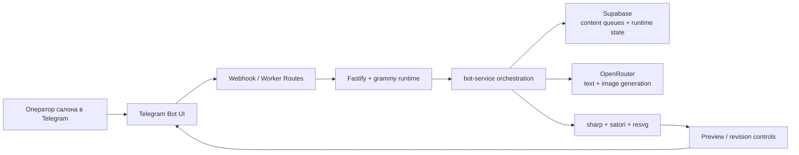

# SMM Automation Bot

Telegram-бот для салона красоты, который помогает готовить контент прямо в чате без отдельной админки.

## Что это за проект

`SMM Automation Bot` собирает рабочие фото и темы из Supabase, генерирует текст и визуалы через OpenRouter и возвращает оператору готовый preview в Telegram. Основной сценарий не требует отдельного интерфейса: весь путь от выбора режима до ревизий и публикации проходит внутри бота.

Проект задуман как прикладной продукт для малого beauty-бизнеса, где владелец или администратор работает прямо из Telegram и не тратит время на ручную сборку карточек, историй и постов в нескольких сервисах.

Подробный продуктовый разбор вынесен в [CASE_STUDY.md](./CASE_STUDY.md).

## Какую задачу решает

- сокращает путь от исходника до готового контента;
- стандартизирует подписи, визуалы и продуктовые сценарии;
- удерживает оператора внутри одного Telegram-first workflow;
- ускоряет выпуск постов, stories и каруселей без отдельного back office.

## Что именно реализовано в продукте

- `/work`:
  wizard для подготовки поста по 1-3 фотографиям работы мастера с revision-controls и превью.
- `/topic`:
  экспертный пост по подготовленной теме из очереди `expert_topics`.
- `/stories`:
  вертикальное stories-preview по выбранной теме из `story_topics`.
- `/slider`:
  карусель из 3-5 слайдов по теме из `slider_topics`.
- `Supabase` как источник очередей контента, runtime-state и технических таблиц.
- `docs-contract tests`, которые удерживают документацию и активный runtime-контракт синхронизированными.
- worker-маршруты и async-dispatch, безопасные для serverless-сценария на Vercel.

Дополнительно в кодовой базе сохранён режим `/creative` для single-image промо-креативов из curated ideas, но основной публичный продуктовый фокус репозитория сейчас сосредоточен на четырёх сценариях выше.

## Почему это хороший кейс

- продуктовый UX собран вокруг реального операционного сценария салона, а не вокруг абстрактной CMS;
- `/work` сочетает wizard, генерацию, preview и revision-controls в одном чате;
- контентные режимы работают через очереди тем и идей, а не через хаотичные ручные запросы;
- runtime адаптирован под serverless-ограничения Vercel и тяжёлые media-flow внутри Telegram.

## Архитектурная схема



## Ключевые инженерные решения

- `Telegram-first` вместо отдельной админки.
  Это сокращает операционный путь и уменьшает количество пользовательских поверхностей.
- `bot-service` как единый orchestration layer.
  Вся продуктовая логика, callback-flow, генерация и revision-cycle сходятся в одном сервисе, а не размазаны по route handlers.
- `Supabase` как источник очередей и runtime-contract.
  Это упрощает контентные pickers, резервы тем, публикационные статусы и тестируемый storage layer.
- `Vercel + worker routes` вместо длинных синхронных webhook-обработчиков.
  Тяжёлые действия можно выносить из критического пути Telegram webhook без отдельной инфраструктуры.
- docs и tests как часть контрактной поверхности.
  Репозиторий проверяет не только код, но и актуальность ключевых runtime-доков.

## Архитектура

- `Telegram` как пользовательский интерфейс;
- `Vercel` как runtime и deploy target;
- `Fastify` как HTTP-слой;
- `grammy` как bot framework;
- `Supabase` как storage и runtime state;
- `OpenRouter` как провайдер генерации текста и изображений;
- `sharp`, `satori` и `resvg` для сборки итоговых превью и визуалов.

## Структура репозитория

- `src/`:
  runtime приложения и основная orchestration-логика.
- `api/`:
  Vercel handlers для webhook, worker, cron и health routes.
- `supabase/schema.sql`:
  storage contract.
- `tests/`:
  runtime, contract и docs tests.
- `smm_salon_docs/`:
  техническая документация по продукту, runtime и bootstrap.

## Как смотреть репозиторий

1. `README.md`
2. `CASE_STUDY.md`
3. `smm_salon_docs/01_system_spec.md`
4. `smm_salon_docs/02_bot_service_bootstrap.md`
5. `src/services/bot-service.mjs`
6. `tests/`

## Быстрый запуск

1. Скопировать переменные окружения из `smm_salon_docs/config/.env.example`.
2. Установить зависимости:

```bash
npm install
```

3. Запустить локально:

```bash
npm run dev
```

## Проверка

```bash
npm test
```

## Деплой

Проект рассчитан на Vercel. Актуальный runtime-контракт и bootstrap описаны в:

- `smm_salon_docs/01_system_spec.md`
- `smm_salon_docs/02_bot_service_bootstrap.md`
- `smm_salon_docs/03_roadmap_and_doc_governance.md`
